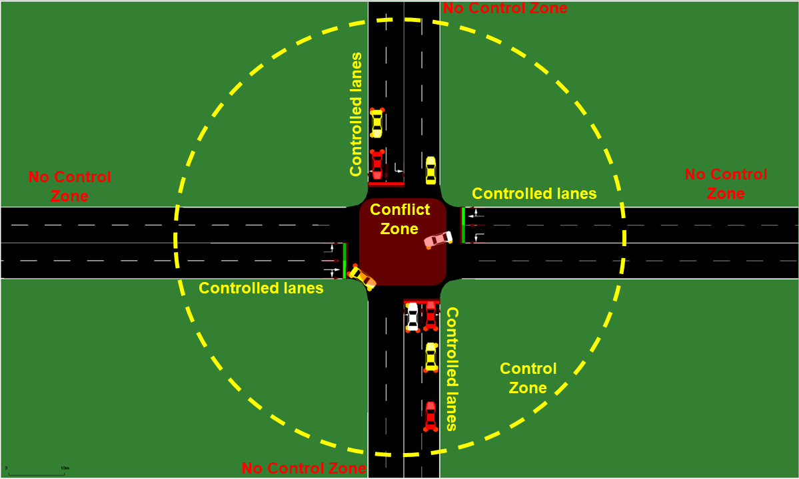
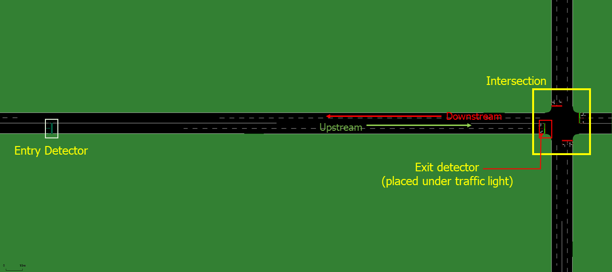
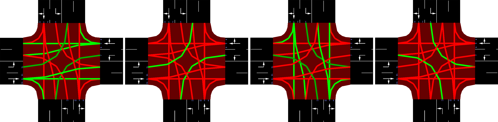
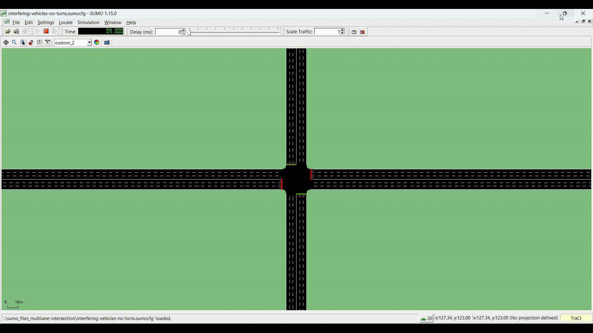

# Signalized Intersection Optimization (SUMO)

A MATLAB ↔ [SUMO](https://eclipse.dev/sumo/) simulation harness for testing
per-vehicle velocity-planning / optimal-control (OCP) algorithms against a
signalized intersection, using [TraCI4Matlab](https://github.com/pipeacosta/traci4matlab)
to drive a SUMO microscopic traffic simulation from MATLAB in real time.

This repo is **not** an implementation of a specific published algorithm —
it's the connective tissue around one: per simulation step it classifies
vehicles by type and control-zone membership, reads live signal-phase/timing
state for any connected/autonomous vehicle (CAV) entering the intersection's
detection zone, hands that state to a solver, and replays the returned
speed profile back into SUMO via TraCI. Swap out the solver and you can
evaluate a different velocity-planning strategy against the same network,
detectors, and MPR/demand sweep infrastructure without rewriting any of the
SUMO/TraCI plumbing.

## The extension point

Each vehicle is solved once, at the moment it enters the E3 detector zone
(`main_SUMO.m`), via:

```matlab
[OCvel, OCacc, fgr] = OC_SUMO(sgr, l, v_step, tg, tr, tlElapsedTime)
```

| Input           | Meaning                                                    |
|-----------------|-------------------------------------------------------------|
| `sgr`            | current signal phase: `1` = green, `0` = red                |
| `l`              | distance from vehicle to the stop line (m)                  |
| `v_step`         | vehicle speed at zone entry (m/s)                            |
| `tg`             | full green duration of the relevant signal phase (s)         |
| `tr`             | full red duration of the relevant signal phase (s)            |
| `tlElapsedTime`  | time already elapsed within the current signal phase (s)     |

| Output   | Meaning                                                              |
|----------|------------------------------------------------------------------------|
| `OCvel`  | velocity profile (m/s) for every future simulation step until crossing |
| `OCacc`  | corresponding acceleration profile (m/s²)                              |
| `fgr`    | `1` if the vehicle can cruise at its current speed and still make green |

That function signature is the contract. Any per-vehicle velocity-planning
method — a different OCP formulation, MPC, a learned policy, a heuristic —
can be dropped in behind it; `main_SUMO.m` and the rest of the harness don't
need to change.

As a reference point, this harness was originally built and validated
against an eco-driving OCP formulation ("ECO-AND") from:

> X. Meng and C. G. Cassandras, "Eco-Driving of Autonomous Vehicles for
> Nonstop Crossing of Signalized Intersections," *IEEE Transactions on
> Automation Science and Engineering*, vol. 19, no. 1, pp. 320-331, Jan. 2022.


That specific solver implementation is not included in this repo (see
below) — it's mentioned here only as the algorithm this harness was
originally exercised with, not as what this repo ships.

## What's in this repo

```
.
├── matlab_sumo_interface/            MATLAB/TraCI simulation harness
│   ├── main_SUMO.m                   Entry point: single simulation run
│   ├── main_SUMO_simloop.m           Parameter sweep launcher (vph / range / MPR)
│   ├── OC_SUMO.m                     Solver dispatch point — the extension hook described above
│   ├── SUMO_Init.m                   Starts SUMO via TraCI, wires up file paths
│   ├── Env_Const.m                   Vehicle/environment physical constants
│   ├── vehInsideMEMEDetectors.m      Classifies vehicles by type and control-zone membership
│   ├── tl_utils/                     Traffic-light phase/timing lookup utilities
│   └── post_processing/              Parses SUMO XML output into tables and plots
│
└── SUMO_network_files/
    └── sumo_files_multilane-intersection/   4-arm, 3-lanes-per-arm SUMO
                                              network, route files, and E3
                                              detector definitions
```

## What's not included

- **A solver.** `matlab_sumo_interface/eco-and/` (the OCP implementation
  this harness was validated against) is not distributed here — see the
  interface contract above for what to provide instead.

## Requirements

- MATLAB with [TraCI4Matlab](https://github.com/pipeacosta/traci4matlab) on
  the path
- [SUMO](https://eclipse.dev/sumo/) (with `sumo-gui` available on `PATH`)
- Python 3 (optional — only needed for the XML→CSV helper scripts under
  `SUMO_network_files/sumo_files_multilane-intersection/`)

**Known TraCI4Matlab issue:** `traci.trafficlights.getNextSwitch()` and
`getPhaseDuration()` — both used by `tl_utils/globalTLsInformation.m` — are
affected by a type-mismatch bug that corrupts their return values (see
[traci4matlab#8](https://github.com/pipeacosta/traci4matlab/issues/8)). A
root-cause fix is up for review in
[traci4matlab#29](https://github.com/pipeacosta/traci4matlab/pull/29); until
it's merged, apply that patch locally before running this harness.

## Running a simulation

1. Implement `OC_SUMO.m`'s solver contract (above) and place it at
   `matlab_sumo_interface/eco-and/`, or point `OC_SUMO.m` at your own
   solver.
2. Open MATLAB with `matlab_sumo_interface/` as the working directory.
3. Set `vph`, `range`, and `eco_thm` at the top of `main_SUMO.m`, then run it
   for a single simulation, or use `main_SUMO_simloop.m` to sweep multiple
   configurations.
4. Results (SUMO XML output, `.mat` files, summary plots) are written to
   `matlab_sumo_interface/SUMO_results/<timestamp>-.../` and parsed
   automatically at the end of each run via `post_processing/readAllData.m`.

## Results

### SUMO environment

The test network is a 4-arm signalized intersection with 3 lanes per arm.
Multi-Entry-Multi-Exit (E3) detectors mark the DSRC control-zone boundary on
each approach: once a CAV crosses an entry detector, the harness takes over
its speed via the solver contract described above; it's released back to
free-flow after crossing the exit detector at the stop line. The signal
itself runs a 4-phase cycle (protected through/left movements per arm).

<p align="center">
  
  
</p>

<p align="center">
  
</p>

**OC-controlled vehicles crossing under mixed MPR:**



*Color legend: **green** vehicles are executing the OCP speed profile inside
the control zone, turning **white** once they cross the intersection and
return to free-flow; **blue** vehicles are AVs for which the solver could
not find a feasible non-stop trajectory; **yellow** vehicles are
human-driven (HDVs), uncontrolled throughout.*

**MPR sensitivity — 400 veh/h/lane, 300 m DSRC range:**


*A downward trend is noticeable across vehicle wait time, fuel consumption,
and CO2 emissions as MPR increases from 0% to 100%, validating the
controller's effect on network-level performance.*

## Acknowledgements

This work originated from a project funded by the Transportation Consortium of South-Central States (Tran-SET) (Project No.
22ITSLSU41). Testing support was provided by the Louisiana Transportation Research Center (LTRC) and Louisiana State University.

This work reflects an active research project. For updates regarding the project or to access complete project codes, please contact **Principal Investigator:** Xiangyu Meng, Ph.D., Division of Electrical and Computer Engineering, Louisiana State University — xmeng5@lsu.edu


